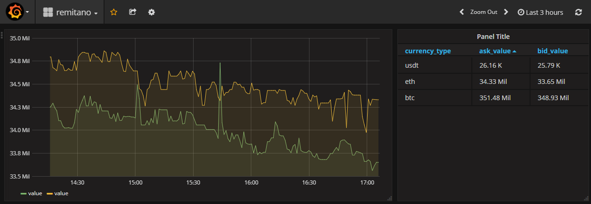

# myPostgresGrafana

## To-do:
* [x] Run PostgreSQL and Grafana (by docker-compose)

* [x] Config Postgres DB
	* [x] Create User, Database, Table
    * [x] by Adminder
    * [x] by CLI

* [x] Config Gtafana
	* [x] Add data source (PostgreSQL)
  * [x] Create dashboard (time series, table)
    * [x] Create query 

## Implementation:

 

## Note:
* postgres

      docker exec -ti -u prosgres container_name bash #access bash inside docker cointainer
      sudo -i -u postgres #user postgres
      psql -h localhost 	#connect to db
      \connect db01		#use db01
      su -				#back to root
      postgres -V
      psql postgres
      \du	#list user
      \q # quits
      CREATE ROLE username WITH LOGIN PASSWORD 'quoted password'
      CREATE DATABASE databasename;
      psql postgres -U patrick
      You’ll notice the prompt is slightly different – the # has changed to a >. This indicates you’re no longer using a Super User account.
      grant all privileges on database <dbname> to <username> ;

* adminer

		default user:postgres

* grafana

      SELECT 
        $__time(timestamp),
        bid_value as value
      from remitano
      where
        currency_type = 'eth'
     
 * networking
 
    map port from container to host
    
    open firewall to go to outside (digitalocean has 2 layers of firewall (one on host, one on do admin page))

## Tutorial:
* Tutorial 1

	https://www.sitepoint.com/getting-started-sqlite3-basic-commands/
	http://stackabuse.com/a-sqlite-tutorial-with-python/

	https://wiki.postgresql.org/wiki/Psycopg2_Tutorial
	https://pythonspot.com/python-database-postgresql/
	https://medium.com/@beld_pro/quick-tip-creating-a-postgresql-container-with-default-user-and-password-8bb2adb82342

	https://www.cybertec-postgresql.com/en/announcing-pgwatch2-a-simple-but-versatile-postgresql-monitoring-tool/
